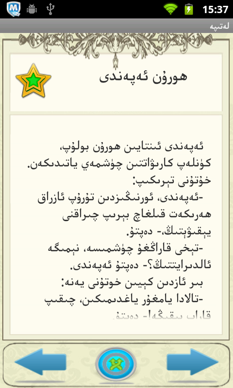
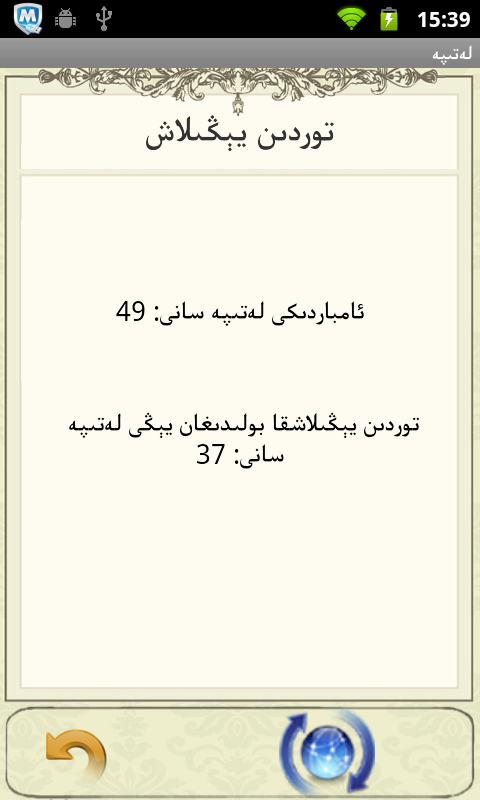

Letipe
======

A letipe (aka [Nasreddin jokes](http://en.wikipedia.org/wiki/Nasreddin)) reader in Uyghur language. The server side program is based on Microsoft .NET. Letipes are saved on the server, this app pulls letipes from your url of choice as a JSON file.

Screenshots
---------

How To Use
---------
Change the server address to your url of choice in values/strings.xml

Download Link:
----------
[Download from Bilkan Bazar](http://bazar.bilkan.net/App.aspx?id=175)
